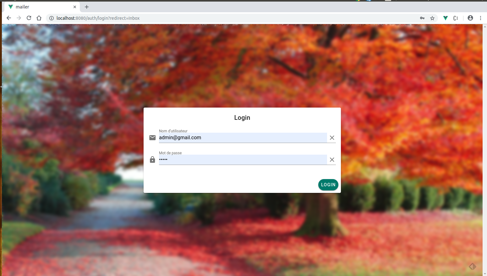
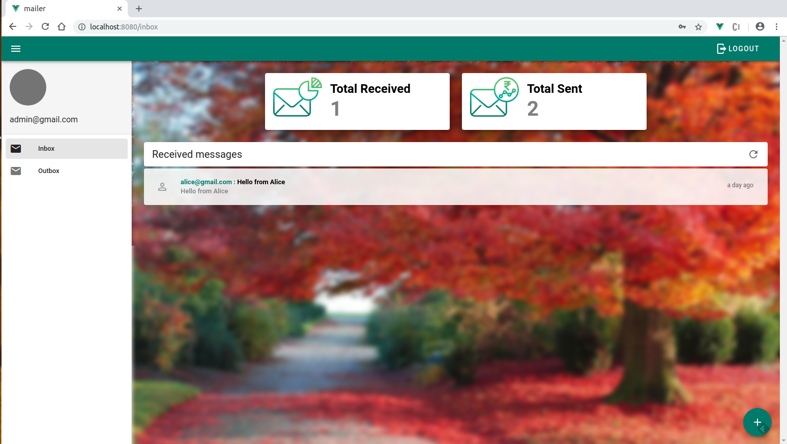
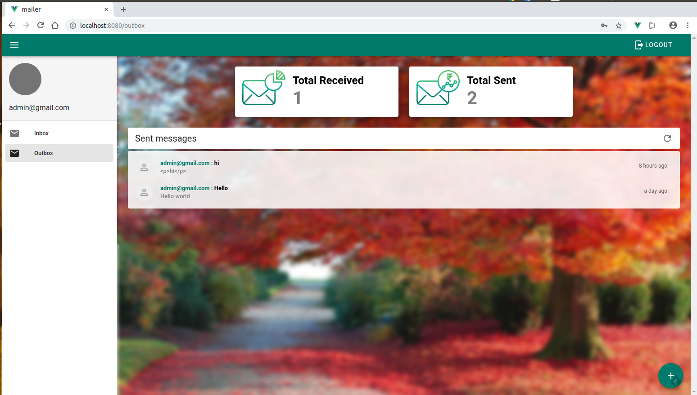
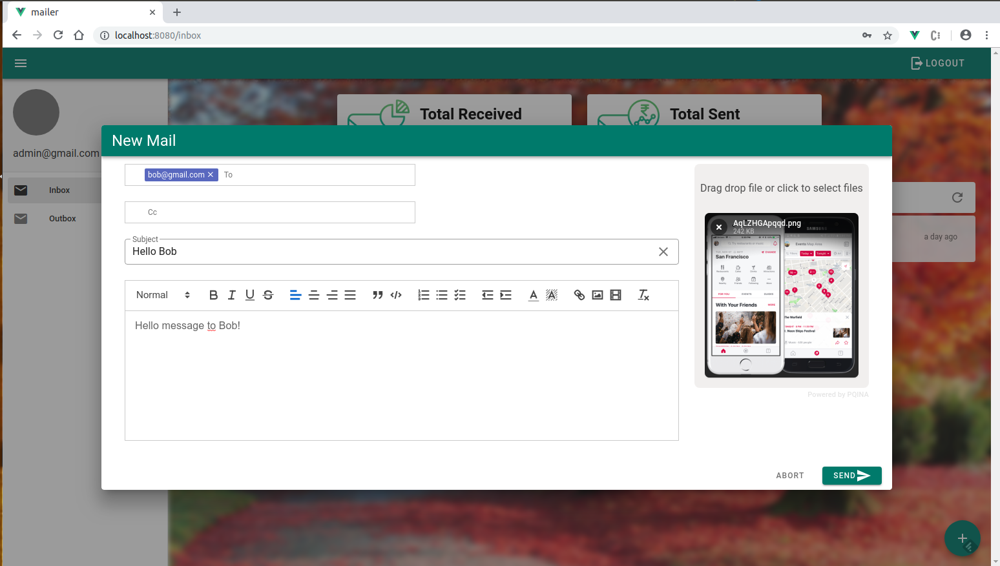
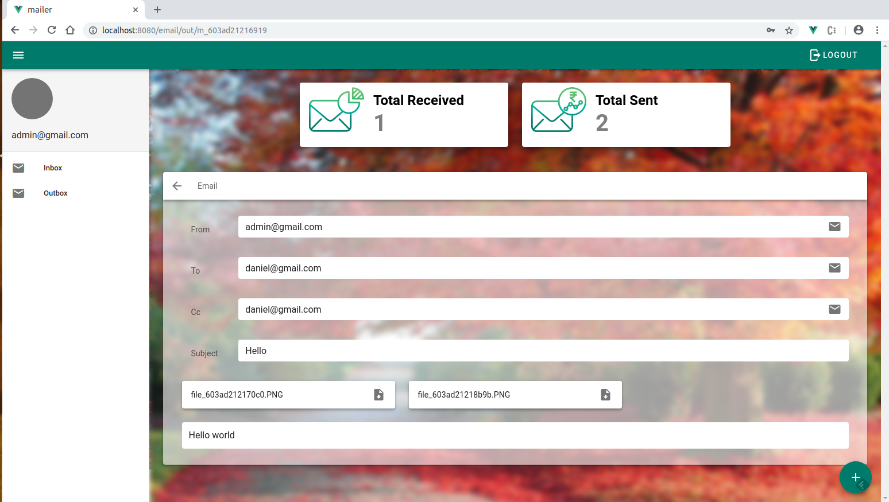

## Introduction

This project is a front-end web app (Mailer app) built with Vue.js framework and  [Vuetify](https://vuetifyjs.com/en/) to send mails. It consumes a back-end API built with Laravel framework :

## Set-up instructions

#### 1. Clone the project
Clone the project from this repository https://github.com/BorisEkue/Mailer.git

```
    > git clone https://github.com/BorisEkue/Mailer.git
```

#### 2. Install node modules
```
    > cd Mailer
    > npm install
```

#### 3. Run the project
By default, the Mailer app will consume the REST API endpoints at the address **http://localhost:8000**.
To change it, please update the file **axios.ts** located at **/src/plugins/axios.ts** at line 10.

To run the project:

```
    > npm run serve
```

The application is accessible by default on port 8080

#### 4. Log in information
To log into the web application please use these credentials

```
    login: admin@gmail.com
 Password: admin
```

## Some screenshots

#### Login interface




#### Home dashboard




#### Emails sent interface




#### Send new mail interface




#### View mail details interface

